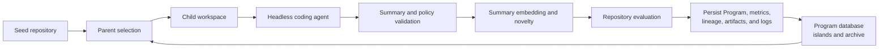

# ShinkaEvolve System Architecture

## Scope

This is the canonical architecture document for the repo-agent evolution
implemented in this fork. The original Shinka guides and API reference describe
the upstream product and remain intentionally unchanged.

The active `ShinkaEvolveRunner` is repository-only: it requires a seed
directory, evolves repository states with Headless coding agents, evaluates
those states, and stores them in the existing `Program` database model. The
evolution algorithm remains recognizable as Shinka; the artifact and mutation
boundaries are different.

Planned work belongs in [Backlog](backlog.md), not in this document.

## System At A Glance



The trusted-local and secure modes share this logical loop but use different
artifact identities and isolation boundaries.

## Architectural Invariants

1. A candidate is a repository state, not a generated source string.
2. The database continues to call an individual a `Program`; repo-specific
   fields extend that model.
3. A Headless coding agent edits a child workspace directly. Shinka does not
   apply prose patches returned by the agent.
4. `.shinka/individual.md` is the compact representation used for context,
   embeddings, and novelty. It is a sidecar persisted with run data, not part of
   the executable candidate.
5. Every proposal has a parent identity, an isolated workspace, a named agent
   session, a validated material change, and a durable result or failure
   record.
6. `trusted_local` is only for public evaluators and cooperative candidates.
   Sealed, private, or adversarial evaluation requires `secure`.
7. Worktree policy limits what becomes a candidate. It is not a secrecy
   boundary.
8. Provider transport health is tracked separately from model-quality rewards.
9. Unknown Headless usage or pricing remains explicitly unknown; it is never
   recorded as zero.

## Individual And Artifact Model

The durable evolutionary row remains `shinka.database.Program`.

| Area | Important fields |
|---|---|
| Identity and lineage | `id`, `parent_id`, `generation`, `island_idx`, inspiration IDs |
| Repository state | `repo_commit`, `repo_parent_commit`, `repo_diff`, `changed_files` |
| Secure artifact state | `artifact_uri` and candidate digest metadata |
| Compact representation | `repo_summary`, `summary_version`, compatibility `code` |
| Mutation policy | `mutable_paths`, `immutable_paths` |
| Agent execution | provider, model, session ID/name, prompt/response metadata |
| Evaluation | public/private metrics, combined score, correctness, feedback |
| Search | embedding, archive membership, migration history, sampling metadata |

Artifact identity depends on the evaluation mode:

- In `trusted_local`, a candidate is a real Git commit in a worktree derived
  from the seed repository.
- In `secure`, a normalized content-addressed archive is the executable
  identity. The agent receives a disposable synthetic Git repository for coding
  ergonomics and diff inspection; its Git commit is not the security identity.

Reproducing a candidate therefore requires the run database or export, the
summary, evaluator/run manifest, logs, and either the Git commit or the secure
artifact digest. A commit alone is insufficient because `.shinka/` is ignored.

## Evolution Lifecycle

### 1. Bootstrap

1. Validate `seed_repo_path`.
2. In trusted-local mode, initialize and commit a plain directory or require an
   existing Git repository to have a clean working tree.
3. In secure mode, normalize the seed into an immutable content-addressed
   artifact.
4. Create the generation-zero workspace.
5. Read or generate `.shinka/individual.md`.
6. Evaluate and persist generation zero.

### 2. Select And Materialize A Child

The database samples a parent and optional archive/top-k inspirations using the
configured islands, archive, parent strategy, and model-selection policy. The
runner creates a child workspace from the parent's commit or artifact digest.

The prompt contains structured task context:

- task objective and evaluator-facing contract;
- parent summary, metrics, and public feedback;
- inspiration summaries;
- mutable, immutable, and omitted presentation paths;
- required summary schema; and
- validation requirements.

The agent sees the candidate workspace and edits it directly.

### 3. Validate And Snapshot

Before evaluation the runner verifies:

- the summary exists, is non-empty, fits the size limit, has the supported
  schema version and headings, and contains no template placeholder;
- the parent marker matches the sampled parent;
- the proposal made a material repository change;
- immutable, omitted, protected, and out-of-scope paths were not changed;
- symlinks, submodules, deletion, lockfile, binary, and file-size policies are
  satisfied; and
- the Shinka-owned policy files were not modified.

Trusted-local mode commits the child worktree. Secure mode creates and verifies
a normalized archive and records its digest.

### 4. Novelty, Evaluation, And Persistence

The runner embeds `repo_summary`, not the source tree or path. Optional novelty
judging compares the candidate summary with relevant parent, island, and archive
summaries.

An accepted candidate is submitted to the selected evaluator. Completion
persists the metrics, correctness, summary, artifact identity, diff,
changed-file list, lineage, timing, costs, agent metadata, and failure details.
Island/archive updates then make the individual eligible for future sampling.

`generation_target_mode` controls what `num_generations` actually budgets:

- `evaluated_candidates` is the default. The target is the number of logical
  `Program` rows durably persisted after evaluation, including generation zero
  and evaluated candidates that are incorrect. Pre-evaluation failures—such as
  provider failure, no material change, policy rejection, or novelty
  rejection—do not count. Proposal generation IDs may therefore rise above
  `num_generations` until enough evaluated rows exist.
- `proposal_ids` preserves the older allocation semantics. Only generation IDs
  `0` through `num_generations - 1` may be assigned. If some proposals never
  reach evaluation, the run can stop with fewer persisted candidates; the
  missing IDs are reported rather than replaced with higher IDs.

For example, with a target of five, generation zero counts as the first
evaluated candidate. If proposal IDs 1 and 2 fail before evaluation,
`evaluated_candidates` can continue with later IDs until five rows are stored.
`proposal_ids` still stops after the five-ID budget is exhausted, even if fewer
than five rows were stored. Concurrent results beyond an already reached
evaluated-candidate target are discarded rather than silently overshooting it.

## Summary Contract

The canonical sidecar is:

```text
.shinka/individual.md
```

The current `repo-individual-v1` schema requires:

```markdown
# Individual Summary

Schema-Version: repo-individual-v1

## Parent

## Core Idea

## Lineage Context

## Changed Files

## Validation Performed

## Performance Hypothesis

## Risks and Followups

## Minimal Snippets
```

The summary should explain the idea, changed files, validation, performance
hypothesis, and risks with only minimal snippets. The full diff is stored
separately. Future agents receive summaries rather than entire ancestral source
trees.

## Mutation Policy

The policy defaults favor repository-level autonomy:

```text
mutable_paths omitted or empty  => all ordinary candidate paths are mutable
mutable_paths non-empty         => explicit allow-list
immutable_paths                 => deny-list; always wins
agent_hidden_paths              => omitted from the agent's presented view
ignore_paths                    => Shinka/Git sidecars such as .git and .shinka
```

Deletions, dependency lockfile changes, and binary files are allowed by default
and have explicit configuration controls. File-size limits are optional.
Traversal, escaping symlinks, unsafe archive members, protected policy-state
changes, and invalid submodule boundaries are rejected.

`agent_hidden_paths`, read-only files, Git worktrees, and prompt instructions do
not hide secrets from hostile code. Private evaluator code, credentials,
holdouts, and result stores must never be placed in the candidate artifact.

## Agent And Provider Layer

Every proposal gets a stable name such as `shinka-gen-<generation>-<id>` and a
proposal-scoped session home. Repair attempts reuse that session and workspace
so the agent can respond to a missing summary or policy error without starting
over.

The Headless provider:

- honors the proposal working directory;
- supports worktree-result mode, where repository state is the output;
- captures stdout, stderr, prompts, session metadata, usage, and pricing status;
- terminates only owned process groups on timeout;
- redacts credentials from returned logs and purges a session home if an exact
  credential copy is detected; and
- uses typed route failures for authentication, transport, timeout, extraction,
  mutation, policy, and evaluator failures.

A route-health circuit breaker temporarily removes unhealthy provider/model
routes. UCB or other model selection learns from evaluated candidate quality,
not from authentication or transport failures. A shared provider/model/request
class limiter enforces concurrency, requests per minute, and declared daily
quotas. Startup rejects a run when its known minimum auxiliary request demand
already exceeds a configured quota.

## Evaluation Boundaries

### Trusted Local

`evaluation_mode: trusted_local` passes a host worktree path to the evaluator:

```bash
python evaluate.py --repo_path /path/to/worktree --results_dir /path/to/results
```

The normal result contract is:

```text
metrics.json
correct.json
feedback.txt  # optional
logs/         # optional
artifacts/    # optional
```

This mode preserves the simple repo evaluator contract and supports local or
scheduled jobs. The candidate and evaluator share host trust; it is not suitable
for private or adversarial scoring.

### Secure

`evaluation_mode: secure` is fail-closed:

1. Normalize and sanitize the candidate into an immutable artifact.
2. Run mutation in a restricted container with a proposal-scoped session home
   and only reviewed provider egress.
3. Snapshot the mutated candidate into a new content-addressed artifact.
4. Optionally build with a digest-pinned, networkless build boundary.
5. Run the candidate as a restricted, persistent, networkless service.
6. Keep the evaluator, private inputs, scoring logic, job database, and result
   validation on the trusted side.
7. Exchange bounded, versioned protocol messages with the candidate.
8. Validate the result against the exact job and artifact identities, metric
   allow-list, schema, and feedback-size limit.
9. Publish only public metrics and bounded feedback to evolution.

Mutation, build, and runtime images must be pinned as
`name@sha256:<64 hex>`. Credentials are injected at runtime from explicit
operator profiles and environment-name allow-lists; credential values are not
persisted in proposal metadata.

The secure mutation image provides Python 3 as `python` and `python3`, plus
`pip3` and `venv`. User-defined dependencies are prepared from the task's
hash-pinned `dependency_manifest_path` before execution and mounted read-only
at `/dependencies`; `SHINKA_DEPENDENCY_ROOT`, `PIP_NO_INDEX=1`, and
`PIP_FIND_LINKS=/dependencies/files` make package installation explicitly
offline. OS-level requirements belong in the separately pinned mutation image.

The last published and locally qualified universal Headless image is:

```text
ghcr.io/anantgar/shinka-headless-agents@sha256:7624da6fd6e8138d15b9553732e683d30832d3f090dfb00ad426e528c3dcfc7f
```

That recorded digest predates the Python-runtime change above. Rebuild and
publish `containers/headless-agents/Dockerfile`, then use the workflow's newly
reported immutable digest before starting a secure run; do not reuse the
recorded digest for this contract.

The container boundary, read-only candidate handling, network and Docker-socket
denial, resource limits, cleanup, and a two-turn durable Antigravity session
have been qualified locally. This is implementation evidence, not a claim of
production qualification or benchmark performance.

## Durability And Recovery

Long-running evaluation is represented by durable SQLite job and mutation state.
Launch intent is recorded before execution. Records include job/candidate
identity, phase, worker ownership and heartbeat, result location, timestamps,
failure class, and acknowledgement/cleanup state.

On restart, the secure coordinator reconciles pending and running records,
recognizes lost workers, resumes result handling where safe, and records
terminal failures otherwise. Candidate workspaces and runtime resources are
retained until the evolutionary database row is durable and the coordinator has
acknowledged cleanup.

Each run writes `run_manifest.json`, including:

- framework commit and dirty-diff hashes;
- effective configuration and its hash;
- evaluator path and hash;
- evaluation mode and pinned images;
- provider/CLI version information where observable;
- proposal timeouts;
- rate limits, quotas, and minimum demand;
- requested/effective worker information; and
- stable W&B run identity.

## Module Ownership

| Module | Responsibility |
|---|---|
| `shinka/core/async_runner.py` | Evolution orchestration, concurrency, proposal/evaluation lifecycle, persistence |
| `shinka/core/sampler.py` and `shinka/prompts/` | Parent/inspiration context and mutation prompts |
| `shinka/repo/worktree.py` | Trusted-local Git worktrees and path policy |
| `shinka/repo/secure_worktree.py` | Disposable secure agent workspaces and artifact-compatible snapshots |
| `shinka/repo/summary.py` | Summary schema, templates, and validation |
| `shinka/llm/` | Provider invocation, Headless sessions, route health, rate limiting, usage/cost metadata |
| `shinka/database/` | `Program` persistence, islands, archive, selection, migration, and async access |
| `shinka/launch/` | Trusted-local/Slurm scheduling and secure scheduler adapter |
| `shinka/secure/` | Contracts, archives, artifacts, containers, mutation, evaluator protocol, jobs, sessions, and recovery |
| `shinka/embed/` | Summary embeddings |
| `shinka/core/novelty_judge.py` | Summary-based novelty assessment |
| `shinka/run_manifest.py` | Reproducibility manifest and stable W&B identity |
| `shinka/webui/` and `shinka/plots/` | Inspection and visualization |

## Comparison With Original Shinka

Repo-agent Shinka preserves islands, archives, parent/inspiration selection,
metrics and feedback, novelty rejection, model selection, and asynchronous
proposal/evaluation flow. It deliberately changes:

| Boundary | Original loop | Repo-agent loop |
|---|---|---|
| Mutation | Model emits code/diff text | Coding agent edits a repository with tools |
| Candidate | One program string/file | Git commit or content-addressed repository artifact |
| Context | Parent/inspiration source | Live workspace plus compact summaries |
| Novelty text | Mutable code | `.shinka/individual.md` |
| Validity gate | Parse/apply and evolve-block checks | Summary, material diff, artifact, and path-policy checks |
| Accounting | API calls/tokens | Agent sessions, workspaces, retries, provider health, compute, and sometimes unknown subscription usage |

Using a newer model or coding-agent harness is not a reproduction of the
ShinkaEvolve paper. Valid claims must distinguish:

- historical reproduction with the frozen paper stack;
- a modern re-benchmark using explicitly pinned current models;
- a component ablation that changes one boundary at a time; and
- a native end-to-end comparison of the complete systems.

For controlled comparisons, pin the upstream commit, task and evaluator
artifacts, dependencies, models, prompts/tool policy, worker counts, hardware,
network, seeds, and all request/evaluation budgets. Use the same authoritative
evaluator and define the operating constraint before examining outcomes.

Every run should report this funnel:

```text
raw mutation requests
  -> valid materialized proposals
  -> novelty-accepted candidates
  -> authoritative evaluations
  -> correct candidates
  -> target-reaching candidates
```

Report best-so-far quality against evaluated candidates, raw requests, cost, and
wall time. Include correctness, sealed-holdout quality, failed proposals,
policy violations, route failures, retries, token/billing status, evaluation
compute, diversity, and reproducibility. A higher-quality but slower or more
expensive result is a trade-off, not an unconditional win.

The experiment itself remains open work in [Backlog](backlog.md).

## Current Maturity

The repo-only core, secure evaluation slice, durable sessions, fake-agent
end-to-end coverage, recovery contracts, and container qualification are on
`main`. A real two-turn Headless mutation canary has passed.

No controlled secure benchmark campaign or production deployment has completed.
Until the operational gates in the backlog pass, describe secure mode as
implemented, automatically tested, and locally container-qualified—not
production-qualified.
